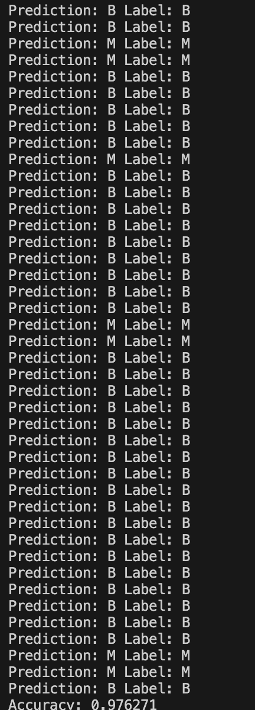

# Multi-Layer-Perceptron

This is neural network project written from screatch in C++

## Define network in network.csv

### The first value is Layer name, neuron count, activation function, initialization function


### Supported activation functions:

relu, softmax sigmoid tanh

### Supportedd initialization functions:

zeros, ones, random, he, heNormal

## Spliting Data

Afterwards you can train the split the data in 2 parts using ./split.sh, that will run C++ code with seed 2002 to split the data in 2 parts training.csv and testing.csv

```
./split.sh
```

## Training

run ./train.sh it will run C++ code that does training of the program

```
./train.sh
```

Afterwards python code will run showcasing the acuracy and predictions of the program, the program is using early stoping to prevent overfitting and to use less compute.


After the process the network topology is exported in network.txt file

## Predict

In prediction fase the neural network is loaded from network.csv file and network.txt file

```
./predict.sh
```


